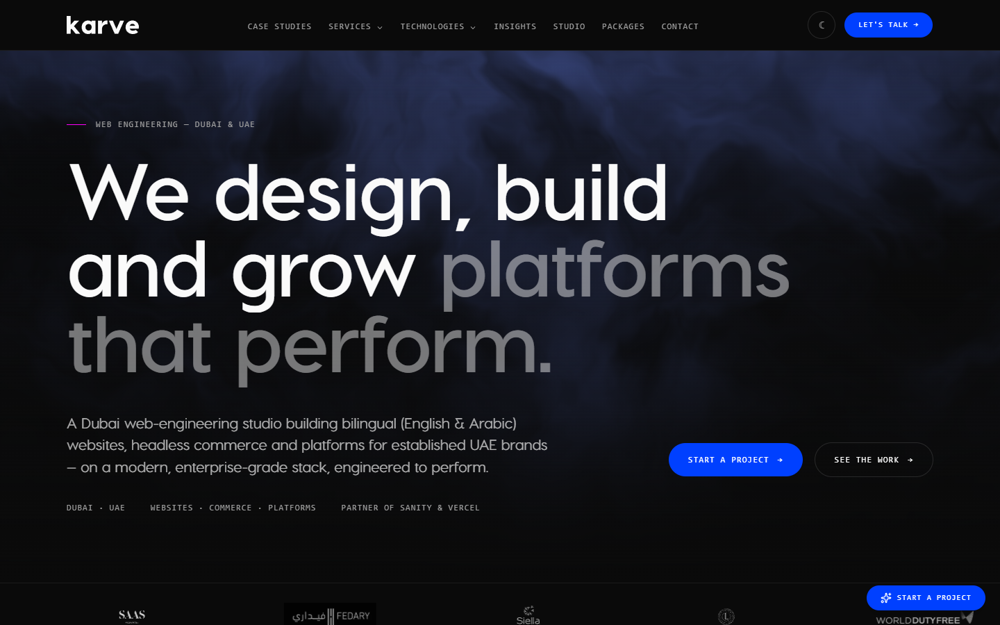
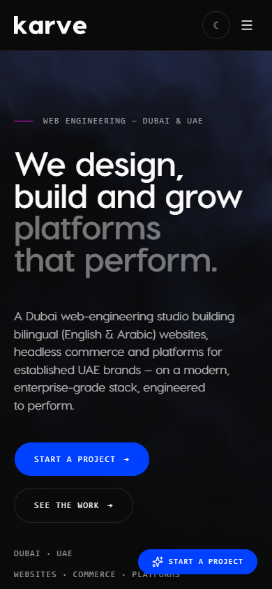
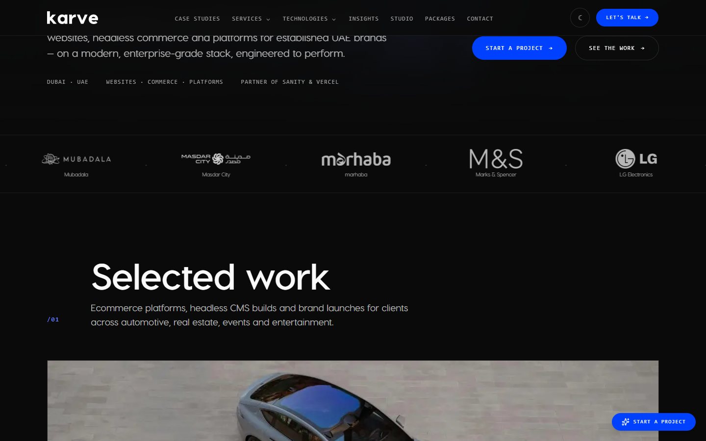
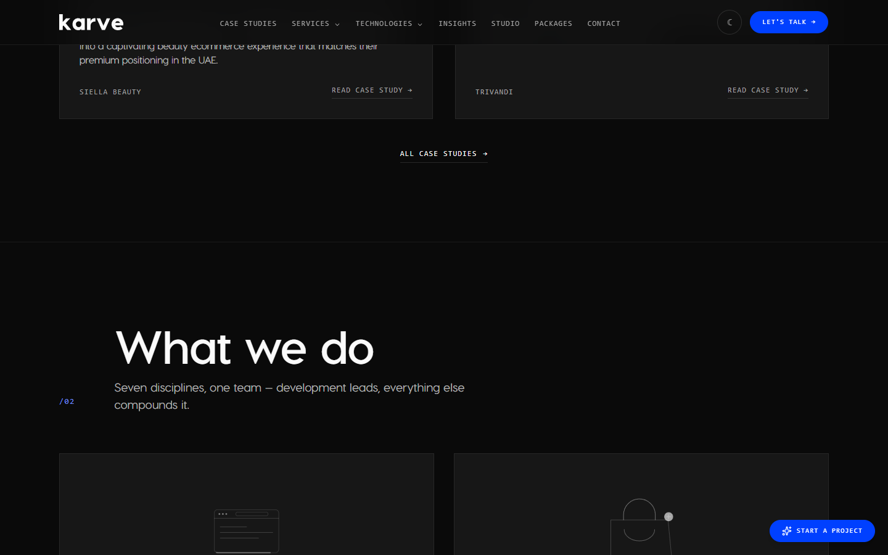
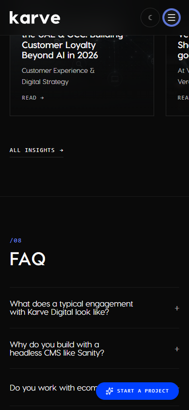
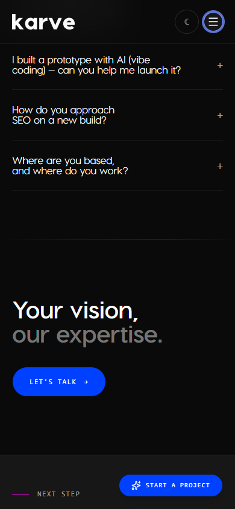

# Karve Digital reference analysis for Kepler Dev

Date captured: 2026-08-13  
Reference: [Karve Digital homepage](https://karvedigital.com/en)  
Target: Kepler Dev agency website  
Viewports inspected: 1440 × 900 and 390 × 844

## Executive verdict

Karve is an excellent reference for Kepler Dev's desired **visual posture**: dark, technically credible, highly controlled, and premium without relying on decorative effects. Its best qualities come from four decisions:

1. A strict near-black, off-white, gray, and electric-accent palette.
2. Very large geometric sans-serif headlines paired with tiny monospace labels.
3. A restrained grid whose sophistication comes from scale, rhythm, and timing rather than complex shapes.
4. A conversion path repeated at predictable moments: primary action, work evidence, services, supporting proof, objections, final action.

Kepler should get close to that system, but should not reproduce the homepage literally. Karve's breadth of services, client-logo wall, public case studies, partner claims, testimonials, package pricing, and publishing cadence are supported by evidence Kepler does not currently have permission to publish. Kepler's connected-operations positioning is more focused and should remain intact.

The strongest translation is therefore:

> **Karve's visual grammar + Kepler's connected-operations story + Kepler's stricter proof rules.**

The current Kepler implementation is already dark and editorial, but it is not yet close to the reference. Its serif headline, literal stock-style hero image, warm coral emphasis, and conventional section composition make it feel like a premium consultancy. Karve feels more like a contemporary product-engineering studio. Closing that gap requires a typography, atmosphere, grid, and motion shift—not simply changing colors.

## Evidence and audit limits

The homepage was loaded in headless Chrome, scrolled through completely, and captured section by section after each scroll reveal had settled. Eleven major states were captured on desktop and mobile. The mobile navigation drawer was opened and inspected. Computed typography, dimensions, landmark structure, visible actions, resource hosts, transitions, and reduced-motion behavior were sampled from the rendered page.

This is a front-end and experience analysis. It does not establish Karve's private CMS model, source code architecture, analytics configuration quality, actual conversion rate, performance under real-user traffic, or full WCAG conformance.

## Reference snapshots

### Desktop hero



### Mobile hero



### Desktop work transition



### Desktop services transition



### Mobile navigation drawer


### Mobile FAQ and closing action





## 1. Visual system

### Palette

The rendered dark theme uses approximately:

| Role | Observed treatment | Design effect |
|---|---|---|
| Page canvas | Near-black, approximately `#080808` | Removes visual noise and makes type and media carry the hierarchy. |
| Primary text | Near-white | Crisp, editorial contrast. |
| Secondary text | Neutral gray | Creates a second headline voice without introducing another hue. |
| Primary action | Electric cobalt, computed `rgb(0, 64, 255)` | Makes the conversion path unmistakable. |
| Micro-accent | Thin blue-to-magenta rules and blue section numbers | Adds technical energy in very small doses. |
| Surfaces | Black or charcoal with hairline borders | Keeps cards subordinate to the page rather than turning everything into a floating tile. |

The page rarely uses shadows, rounded containers, or gradients as independent decoration. The main gradient-like effect is atmospheric: an abstract, blurred blue-black field behind the hero. That atmosphere is important because it creates depth while allowing the typography to remain the focal point.

### Typography

The type system is the clearest source of Karve's identity.

| Element | Desktop | Mobile | Notes |
|---|---:|---:|---|
| Main headline | 115.2px / 109.44px | 48px / 45.6px | Bold, approximately 0.95 line-height, slightly negative tracking. |
| Standard section headline | 74.88px / 76.38px | 38px / 38.76px | Nearly one-line desktop headings; two lines only where needed on mobile. |
| Final statement | 92.16px / 92.16px | 40px / 40px | Uses white/gray contrast within the phrase. |
| Navigation | Approximately 11.5px | Drawer links are much larger | Uppercase monospace with generous tracking. |
| Section markers | Small monospace | Small monospace | Blue numbering creates a persistent document rhythm. |

The main sans serif is a custom variable font exposed as `fontSans`; loaded weights observed were 500, 700, and 900. Monospace defaults are used for technical labels, navigation, dates, indexes, and calls to action.

The important lesson is not the exact font file. It is the **contrast between expressive scale and utilitarian annotation**:

- Big, tightly set sans-serif statements carry emotion.
- Small monospace labels carry structure, evidence, and navigation.
- Body copy stays moderate and readable.
- There is no serif voice competing with the product-engineering tone.

### Grid and geometry

At 1440px, the hero content width is 1248px with 96px side gutters. At 390px, the primary content width is 350px with 20px side gutters. The desktop header is approximately 72px high; mobile is approximately 73px.

Karve uses three related grids:

1. **Full-width atmospheric grid** for the hero and closing statement.
2. **Wide editorial grid** for section headings, descriptions, and numbered markers.
3. **Bordered modular grid** for work, services, pricing, technologies, partners, testimonials, and insights.

Cards are rectangular and mostly square-cornered. Pill shapes are reserved for actions. This gives buttons a distinct interaction language without making the entire interface soft.

### Image direction

The hero does not use a literal team photo, laptop mockup, or product screenshot. It uses an abstract dark field with blue depth and barely legible material texture. That choice communicates digital capability without making an unsupported proof claim.

Project media then becomes the first literal imagery on the page. This is good sequencing: atmosphere first, evidence second.

For Kepler, this suggests replacing the current office-worker hero image with an abstract operations/data atmosphere or a bespoke product-engineering composition. The current image is visually polished but generic and more corporate than Karve.

## 2. Information architecture and page rhythm

The measured page is approximately 14,153px tall on desktop and 14,000px on mobile, with 11 primary sections. Despite its length, it feels coherent because each section answers a different buying question.

| Step | Purpose | General health | Why it works |
|---:|---|---|---|
| 1 | Header and positioning hero | Strong | Immediate category, geography, scope, two actions, and a trust cue. |
| 2 | Client/trust strip and selected work | Strong when evidence is real | Proof appears immediately after the promise. Large media makes the work feel tangible. |
| 3 | Services inventory | Strong but too broad for Kepler | A numbered service system makes a wide offer understandable. |
| 4 | Fixed-scope packages | Strong for qualification | Turns an abstract agency purchase into comparable options. Requires verified pricing and scope. |
| 5 | AI-prototype bridge offer | Strong | Timely problem-specific offer interrupts the long page with a focused message. |
| 6 | Technology stack | Strong supporting detail | Technical credibility appears after outcomes and offers, not before them. |
| 7 | Platform partnerships | Strong only with substantiation | Creates institutional trust, but Kepler must not imitate unsupported badges. |
| 8 | Testimonials | Strong only with permission | Quotes are tied to identifiable people/projects. Kepler must keep this absent until cleared. |
| 9 | Insights | Mixed | Supports expertise and SEO, but adds maintenance cost and can become stale. |
| 10 | FAQ | Strong structure; semantic verification needed | Handles objections immediately before the final action. |
| 11 | Closing statement and footer | Strong | Repeats the core visual motif and gives one obvious next action. |

The sequence is the real template:

```text
Position → proof → capability → offer → technical reassurance
→ institutional/social proof → expertise → objections → action
```

Kepler does not yet have evidence for every stage, so its safe version should be:

```text
Position → problem recognition → connected approach → approved work state
→ offers → process → technical signature → founder/accountability
→ FAQ → project review
```

## 3. Hero analysis

### What works

- The header is fixed, translucent, and visually quiet.
- The logo is oversized enough to feel confident without becoming the hero.
- The small category/location label sets context before the headline.
- The headline dominates the viewport and uses white-to-gray emphasis to control reading order.
- The body copy is limited in width and positioned as qualification, not decoration.
- The primary and secondary actions sit on the same horizontal axis on desktop and stack cleanly on mobile.
- Compact evidence labels under the main content add specificity without becoming badges.
- The blue action color appears nowhere else at the same visual weight.

### Why it feels premium

Premium perception comes from confidence and restraint:

- one dominant message;
- large empty areas around that message;
- deliberate line breaks;
- no decorative card around the hero copy;
- no competing illustration panel;
- a background that supports rather than explains.

### What Kepler should retain from its current hero

- The current connected-operations positioning is more differentiated than a broad design/build/grow claim.
- The project-review CTA is more honest than a generic sales conversation.
- The expectation statement beneath the CTA reduces uncertainty.
- The secondary route to selected work is appropriate.

### What Kepler should change to move closer

- Replace the serif hero type with a geometric/grotesk sans.
- Increase desktop heading scale toward 96–112px, with approximately 0.94–0.98 line-height.
- Use a two-tone emphasis within the headline rather than one uniform color.
- Remove the hard left/right split created by the literal photo.
- Introduce a full-bleed atmospheric hero background.
- Reduce the header's visual segmentation; the current coral rectangle reads more like a conventional corporate CTA.
- Use a pill or compact rounded action, with the accent color reserved for primary conversion.

## 4. Work and proof presentation

Karve makes work the first substantive content after the hero. It uses:

- a client-logo strip;
- a large introductory heading;
- a short category description;
- oversized project media;
- project titles and summaries;
- direct links to case studies;
- a route to the complete work archive.

This makes the page persuasive early, but it depends on substantial, permissioned proof.

Kepler's current policy is correct: do not invent a logo strip, client metrics, public production labels, or testimonials. A Karve-like composition can still work with Kepler's approved states:

- If public studies are approved, show one large feature and two smaller studies.
- If only private evidence is available, show an explicit private-review state with no client mark.
- If no public work is available, collapse the media grid and present the proof protocol rather than an empty decorative card.
- Keep classification, role, team context, and evidence status visible on each item.

## 5. Services and offers

Karve's service section uses a wide inventory organized as repeated numbered rows/cards. Each service combines:

- a discipline number;
- a simple line icon;
- a plain-language title;
- a short outcome description;
- a circular directional action.

This pattern is highly reusable. Kepler should use it for the approved four-offer ladder rather than matching Karve's nine disciplines.

Recommended Kepler translation:

| Index | Kepler offer | Recommended framing |
|---:|---|---|
| 01 | Product Blueprint | Clarify the workflow, users, risks, and first connected release. |
| 02 | Launch Sprint | Build a focused production-ready product around a validated scope. |
| 03 | Operations Platform | Connect roles, workflows, integrations, and management visibility. |
| 04 | Product Care | Maintain, improve, and extend a product after launch. |

The fixed-price section should not be copied until Q-05 is resolved. Karve can publish precise packages because its commercial model supports them. Kepler's current documentation explicitly withholds unapproved prices, durations, and fixed-scope promises.

## 6. Technology, partnerships, and authority

Karve correctly places technology after services and offers. This prevents the homepage from opening as a résumé or tool list.

Its stack is grouped by business-relevant capability: front end, back end/APIs, mobile, content/CMS, commerce, AI, and related systems. The compact typography and bordered cells keep the section dense but controlled.

Kepler should borrow the grouping and timing, not the logo volume. A tighter version could use:

- Product interfaces
- Mobile and field workflows
- Backends and integrations
- Data and operational visibility

Technologies should be supporting evidence inside those groups. The page should not imply certifications, partnerships, or production use where none is approved.

## 7. Conversion strategy

The rendered homepage includes three visible project-start actions, one work-view action, and one or two conversation actions depending on viewport. The primary project action also becomes a floating bottom-right control during scroll.

### Effective aspects

- The visitor is never far from a conversion route.
- The hero provides high- and low-commitment actions.
- The final action repeats the hero's two-tone visual motif.
- FAQ content appears immediately before the last conversion block.
- Offer-specific routes let visitors self-select before contact.

### Risks

- The floating mobile action visibly covers content in several captured states.
- Multiple labels for essentially the same commercial action dilute naming consistency.
- Repeating an action too aggressively can make a premium experience feel performance-marketed.

Kepler's existing CTA governance is stronger: keep **Request a project review** as the one primary label, with route context passed through the contact form. A Karve-like floating CTA should be desktop-only or appear only after the hero and hide near interactive content. On mobile, use inline actions or a compact bottom bar that reserves layout space instead of covering content.

## 8. Motion and interaction

### Observed system

- Major content uses scroll-triggered opacity/translate reveals.
- A common reveal transition is approximately 700ms with `cubic-bezier(0.22, 1, 0.36, 1)`.
- Buttons and small interactive states commonly use approximately 300ms transitions with the same ease family.
- A background graphic uses a 7-second flow animation.
- The fixed header and floating action persist through most of the page.
- Mobile navigation opens as a right-side drawer over a blurred/dimmed page.
- Project, pricing, partner, and article content frequently uses bordered grids or horizontal tracks.

### Why the initial full-page capture appeared empty

The sections were structurally present, but many were visually hidden until their intersection-based reveal ran. A direct full-page screenshot without incremental scrolling therefore contained large black gaps. Once the page was scrolled normally, content appeared and remained visible. This confirms that the perceived polish relies heavily on reveal timing.

### Kepler motion recommendation

Use motion as seasoning:

- 180–280ms for menus, filters, and disclosures;
- 450–650ms for section entry;
- 40–70ms stagger between related items;
- 8–16px maximum vertical translation;
- no parallax required;
- no essential information hidden indefinitely when scripting or observers fail.

The current Kepler motion specification is safer than the reference and should remain authoritative for reduced motion.

## 9. Responsive behavior

### Strong behavior

- Root layout had zero horizontal overflow at both inspected widths.
- Desktop 96px gutters become 20px mobile gutters.
- The 115px hero scales to 48px without losing the headline's hierarchy.
- Standard 75px section headings become 38px.
- Dense grids become horizontal tracks or stacked cells.
- The header collapses to logo, theme control, and menu control.
- The drawer exposes service and technology sublinks directly, reducing nested navigation on mobile.
- The primary hero actions stack with clear separation.

### Weak behavior

- Horizontal project and pricing tracks show partial next cards but depend on gesture discovery.
- The floating CTA overlaps text and cards.
- The menu control's measured box is 32 × 32px, below Kepler's 44px minimum target standard.
- The 14,000px mobile page is very long for a visitor who only needs to understand a focused agency offer.

Kepler should retain its 44px control sizes and avoid matching the reference's page length. A target around 8,500–10,500px on a 390px viewport would preserve the editorial pacing without unnecessary scroll fatigue.

## 10. Accessibility assessment

### Confirmed strengths from rendered evidence

- The header, main content, sections, and footer are represented as structural landmarks.
- The theme control has an accessible label.
- The mobile menu control has an accessible label and `aria-expanded` state.
- Root layout reflows without horizontal page overflow.
- Primary controls are visually distinct.
- Section hierarchy uses one main headline and clear subsequent headings.

### Notable risks

1. **Reduced motion is not adequately honored.** With `prefers-reduced-motion: reduce`, the page still reported 271 elements with non-zero animation or transition behavior, and root smooth scrolling remained enabled.
2. **Small desktop navigation type.** Approximately 11.5px uppercase monospace may be difficult at normal zoom, especially with low-contrast gray.
3. **Small mobile menu target.** The measured 32px button is below Kepler's established 44px target baseline.
4. **Floating CTA obstruction.** It covers meaningful content on mobile, which can interfere with reading and activation.
5. **FAQ semantics need manual verification.** The visible questions behave like accordions, but the audit did not discover them as standard visible buttons or explicit button-role controls. Keyboard and screen-reader behavior should be verified before copying the pattern.
6. **Horizontal tracks need keyboard equivalents.** Partial cards communicate overflow visually, but focus order, scroll control, and item visibility require testing.
7. **Muted contrast needs measurement.** Gray headline fragments and microcopy look intentionally subdued; exact contrast should be checked at each size rather than assumed.
8. **Scroll-reveal resilience.** Content should remain available when observers fail, JavaScript is delayed, or motion is disabled.

Kepler should adopt the look while preserving its stricter focus, touch-target, semantic, and reduced-motion requirements.

## 11. Technical implementation clues

These are rendered-page inferences, not source-code claims:

| Area | Evidence | Likely implementation |
|---|---|---|
| Application framework | `/_next/static/` assets | Next.js application. |
| Styling | Utility-like class names and one compiled CSS asset | Tailwind-style utility CSS or a closely related utility pipeline. |
| Content | Assets loaded from `cdn.sanity.io` | Sanity is used for at least part of the content/media system. |
| Analytics | Google Tag Manager, Google Analytics, and Google Ads resources | Marketing and conversion instrumentation is installed. |
| Fonts | CSS variable class and multiple `fontSans` weights | Locally optimized variable/custom sans font with fallback. |
| Motion | Intersection-dependent reveals, CSS transitions, animated SVG/background groups | A combination of React behavior and CSS/SVG animation. |
| Theme | `dark` class on the root and a labeled toggle | Class-based theme handling. |

Kepler already uses Next.js, React, Framer Motion, and a tokenized CSS foundation, so the technical gap is small. Most of the work is design-system and content composition, not a framework rewrite.

## 12. Direct comparison with the current Kepler homepage

| Area | Karve reference | Current Kepler | Recommended Kepler move |
|---|---|---|---|
| Positioning | Broad studio promise | Focused connected-operations promise | Keep Kepler's message. It is more differentiated. |
| Hero typography | Huge geometric sans | Large editorial serif | Move to a bold grotesk/geometric sans for the agency route. |
| Hero media | Abstract atmospheric field | Literal office-worker image | Replace with a bespoke abstract operations/product atmosphere. |
| Color | Near-black, white, gray, electric blue | Near-black, warm white, coral | Adopt Karve's tonal restraint; test either Kepler coral or cobalt as the single action accent. Do not run both equally. |
| Header | Quiet fixed bar, mono navigation | Segmented bar with large rectangular CTA | Simplify the bar and reduce CTA mass. |
| Section language | Large headings plus `/01` markers | Editorial headlines and numbered labels | Keep numbering; shift heading family and scale closer to Karve. |
| Work proof | Immediate, visual, client-heavy | Publication-safe and sometimes empty/private | Use the same composition only when proof is approved; preserve transparent states. |
| Services | Nine disciplines | Four-offer ladder | Use Karve's row/card system for four focused offers. |
| Pricing | Public fixed packages | Approval-gated | Omit until Q-05 is resolved. |
| Stack | Dense grouped grid | Operational platform diagram and supporting stack | Keep the platform diagram early; add a compact grouped stack later. |
| Partnerships | Large logo matrix | No equivalent approved proof | Do not copy. |
| Testimonials | Named quotes | Approval-gated | Do not copy until permission exists. |
| Insights | Three editorial cards | No established publishing system | Add only if Kepler commits to maintaining useful articles. |
| CTA | Multiple labels plus floating control | One governed project-review label | Preserve Kepler's label consistency; avoid content-covering mobile float. |
| Motion | Dramatic reveal dependency | Restrained, accessibility-led | Borrow easing and timing, not the dependency or reduced-motion gaps. |

## 13. Recommended Kepler homepage modeled on this reference

### Proposed section order

1. **Fixed header** — logo, Work, Services, About, Contact, theme, project-review action.
2. **Atmospheric hero** — Kepler's current connected-operations headline, short scope copy, primary review CTA, selected-work link, concise evidence/status line.
3. **Problem recognition** — current three-handoff diagnosis, simplified into a Karve-like numbered editorial grid.
4. **Connected product model** — people, workflows, systems, and decisions presented as an operational map.
5. **Selected work / evidence state** — one large feature plus two supporting items when approved; otherwise a compact transparent private/no-public-work state.
6. **Four offers** — repeated numbered rows/cards with small line icons and short outcomes.
7. **How engagement works** — project review, blueprint, build, and care as a calm horizontal/stacked sequence.
8. **Technical signature** — four grouped capability cells, with tools subordinate to outcomes.
9. **Founder accountability** — concise founder-led explanation with only approved facts and media.
10. **FAQ** — five to seven questions based on real buying objections.
11. **Closing project-review block** — two-tone headline treatment, one primary CTA, then footer.

### Proposed design tokens

These are starting targets, not a final committed palette:

```css
--canvas: #080808;
--surface: #151515;
--surface-strong: #1b1b1b;
--text: #f7f6f2;
--text-muted: #9b9b9b;
--border: rgba(247, 246, 242, 0.12);
--accent: #ff695b; /* Kepler-continuity route */
/* Alternative concept: --accent: #0040ff; for maximum Karve proximity */
```

Use only one primary accent in the finished system. If cobalt is selected, retain coral only inside the brand mark or remove it from interaction styling. If coral is retained, increase its saturation/brightness enough to command the same hierarchy as Karve's blue.

### Proposed type scale

```text
Hero desktop: clamp(72px, 8vw, 112px), 0.95 line-height, -0.015em
Hero mobile: 46–50px, 0.95 line-height, -0.015em
Section desktop: clamp(56px, 5.2vw, 76px), 1.02 line-height
Section mobile: 36–40px, 1.02 line-height
Body lead: 19–21px desktop, 17–18px mobile
Body: 16–18px
Mono labels/nav: 11.5–13px, 0.10–0.14em tracking
```

### Proposed spacing and dimensions

```text
Desktop content width: min(100% - 12rem, 78rem)
Desktop section padding: 104–144px
Mobile horizontal padding: 20px
Mobile section padding: 80–104px
Header: 72px desktop / 72px mobile
Primary action height: 48–52px desktop / 52–56px mobile
Minimum interactive target: 44 × 44px
Card radius: 0–4px
Button radius: full pill or 2–4px; choose one action language consistently
```

## 14. What not to copy

- Do not copy Karve's text, project arrangements, client names, imagery, bespoke icons, or exact brand treatment.
- Do not publish a logo wall, partner matrix, named testimonials, or metrics without evidence and permission.
- Do not publish package prices or duration promises before Kepler's commercial decision is resolved.
- Do not broaden Kepler into a nine-service full-service agency.
- Do not introduce three competing contact labels.
- Do not use a floating mobile action that covers the content.
- Do not hide large parts of the page until a scroll observer fires.
- Do not inherit the reference's reduced-motion behavior.
- Do not make the mobile page 14,000px long merely to recreate its rhythm.

## 15. Implementation priority

### Phase 1 — Visual foundation

1. Select one accent route: Kepler coral or reference-like cobalt.
2. Replace the agency-route serif with a bold geometric sans.
3. Replace the literal hero photo with an abstract atmospheric asset.
4. Simplify the fixed header and button geometry.
5. Establish the numbered section and mono-label system.

### Phase 2 — Homepage structure

1. Recompose the current problem and platform sections in the new grid.
2. Build publication-safe work states in the Karve-like media layout.
3. Convert the four offers into repeated service rows/cards.
4. Add process, technical signature, founder accountability, FAQ, and closing action.

### Phase 3 — Motion

1. Add restrained section reveals with safe visible defaults.
2. Add action and card hover states.
3. Add mobile drawer transitions.
4. Implement a complete reduced-motion override.

### Phase 4 — Validation

1. Compare reference and implementation at 1440 × 900 and 390 × 844.
2. Validate 320px and 375px reflow on a true mobile emulator/device.
3. Test keyboard navigation, focus return, FAQ semantics, and drawer behavior.
4. Measure contrast for muted gray, accent text, borders, and focus rings.
5. Confirm no claims or assets escape Kepler's approval gates.

## Final recommendation

The right goal is not a Karve clone. It is a Kepler website that produces the same first impression:

- technically assured;
- premium but not precious;
- dark and cinematic;
- easy to scan;
- proof-led;
- extremely clear about the next action.

To achieve that, keep Kepler's existing positioning and CTA governance, then redesign the presentation around Karve's geometric type scale, near-black atmosphere, numbered editorial grid, proof-first sequencing, and restrained motion. The single highest-impact change is the hero: **bold sans-serif type over a full-bleed abstract technical atmosphere, with one unmistakable primary action.**

## Capture inventory

Accepted evidence is stored in this folder:

- `01-home-desktop-full.png` — initial desktop full-page state before scroll reveals.
- `02-home-desktop-hero.png` — desktop hero.
- `03-home-mobile-full.png` — initial mobile full-page state before scroll reveals.
- `04-home-mobile-hero.png` — mobile hero.
- `desktop-01-…` through `desktop-11-…` — desktop section states.
- `mobile-01-…` through `mobile-11-…` — mobile section states.
- `desktop-full-revealed.png` — fully revealed desktop page.
- `mobile-full-revealed.png` — fully revealed mobile page.
- `mobile-menu-open.png` — mobile navigation drawer.

